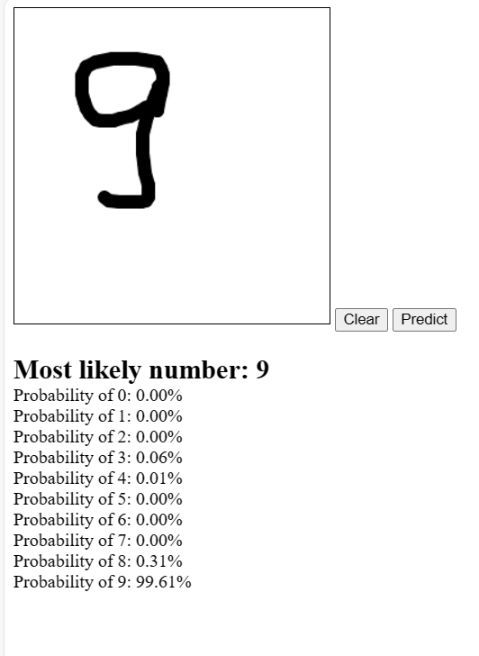

# MNIST--Neural-Network
## Video Demonstration

## Introduction

The MNIST dataset is a popular benchmark for evaluating and understanding machine learning models for digit recognition. Here, we document the evolution of models and their performances as they are enhanced and refined.

## Chapter
1. [Image Classification](MNIST-Image-Classification/README-image-classification.md)
2. [Denoising Autoencoder](MNIST-Denoising-autoencoder/README-autoencoder.md)
